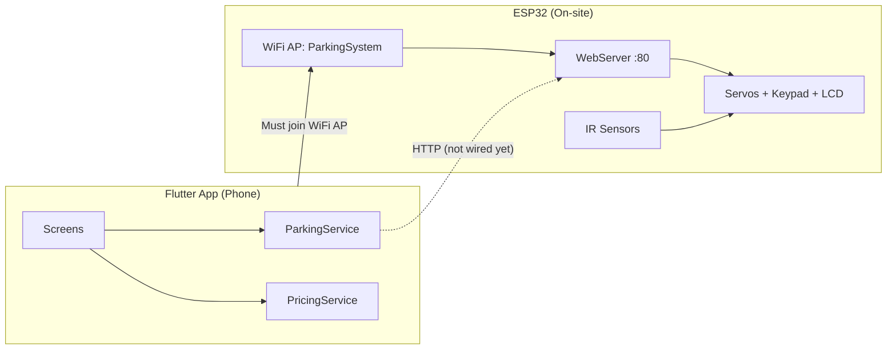

# ParkIQ — Project Knowledge Base

> **Purpose:** Onboarding document for agents and developers. Read this first in any new session to understand the full system — hardware, mobile app, API contract, gaps, and where to edit code.

---

## 1. Project Summary

**ParkIQ** is a smart parking system for a senior/agents course project. It combines:

| Layer | Technology | Role |
|-------|------------|------|
| **Hardware controller** | ESP32 (Arduino C++) | Runs on-site: sensors, gates, LCD, keypad, REST API |
| **Mobile app** | Flutter (Dart) | User-facing: login, browse lots, reserve spots, show PIN/QR at gate |

The hardware firmware lives in **`ESP.txt`** (copy/paste into Arduino IDE; not compiled from this repo). The Flutter app lives under **`lib/`**.

**Current integration status:** The app runs on **mock data**. It does **not** compile cleanly today due to corrupted model code (see §8). The ESP firmware is functional in design but uses a **different API** than what the Flutter README and service layer expect.

---

## 2. System Architecture



### Physical flow (how parking actually works on hardware)

1. **Entry:** Vehicle breaks the **entry IR sensor** → ESP checks if slots are free → generates a **2-digit PIN** (11–99, no zero digits) → shows PIN on LCD → opens **entry servo** for 3 seconds → waits for a slot IR sensor to detect the car → assigns PIN to that slot.
2. **Exit:** Vehicle breaks the **exit IR sensor** → user enters **2-digit PIN on physical keypad** → ESP validates PIN → calculates cost → shows cost on LCD → opens **exit servo** → clears slot.
3. **Mobile app (planned):** Reserve a spot, view status, optionally trigger admin gate open — communicates over HTTP while phone is on the ESP WiFi network.

---

## 3. ESP32 Hardware (`ESP.txt`)

### 3.1 Libraries required (Arduino IDE)

- `WiFi.h` (built-in ESP32)
- `WebServer.h`
- `ArduinoJson.h`
- `ESP32Servo.h`
- `LiquidCrystal_I2C.h`
- `Keypad.h`
- `Wire.h`

### 3.2 Pin map

| Component | Pin(s) | Notes |
|-----------|--------|-------|
| Entry IR sensor | GPIO 12 | `LOW` = triggered |
| Exit IR sensor | GPIO 14 | `LOW` = triggered |
| Slot 1–4 IR | 27, 26, 25, 33 | `LOW` = occupied |
| Entry servo | GPIO 18 | 0° closed, 90° open |
| Exit servo | GPIO 19 | 0° closed, 90° open |
| Green LED | GPIO 23 | Slots available |
| Red LED | GPIO 32 | Parking full |
| Keypad rows | 5, 17, 16 | 3×3 matrix |
| Keypad cols | 4, 15, 13 | Keys 1–9 only |
| LCD I2C | address `0x27`, 16×2 | Via Wire |

### 3.3 WiFi — Access Point mode (important)

The ESP does **not** join your home WiFi. It creates its own hotspot:

| Setting | Value |
|---------|-------|
| SSID | `ParkingSystem` |
| Password | `12345678` |
| Typical IP | `192.168.4.1` (ESP32 softAP default) |
| HTTP port | `80` |

**Implication for the app:** The phone must connect to the `ParkingSystem` WiFi network to reach the ESP. The app’s `ESP_BASE_URL` should be `http://192.168.4.1` (not a LAN address like `192.168.1.100` unless you change the firmware to STA mode).

### 3.4 Business logic constants

| Constant | Value |
|----------|-------|
| `MAX_SLOTS` | 4 |
| `MAX_RESERVATIONS` | 10 |
| `COST_PER_HOUR` | 20.0 (currency unit unspecified in firmware) |
| Minimum billable time | 1 hour (partial hours rounded up to 1) |
| PIN format | 2 digits, range 11–99, **no 0 in tens or ones place** |

### 3.5 Data structures (in-memory, lost on reboot)

**ParkingSlot** (×4): `occupied`, `reserved`, `pinCode`, `entryTime`

**Reservation** (×10): `active`, `username`, `createdAt` — username is hardcoded to `"mobile"` for API calls

**System state:** `freeSlots`, `parkingFull`, `totalRevenue`, `systemStatus` (`READY`, `FULL`, `ENTRY_GRANTED`, etc.)

### 3.6 Main loop behavior

Every `loop()` iteration:

1. `server.handleClient()` — serve HTTP
2. `updateStatusLEDs()` — green/red based on free slots
3. `processPendingParking()` — if entry gate opened, detect which slot got occupied
4. Poll entry IR → `handleEntry()` if triggered
5. Poll exit IR → `handleExit()` if triggered (keypad PIN flow)

### 3.7 REST API (actual ESP endpoints)

Base URL when connected to ESP AP: **`http://192.168.4.1`**

| Method | Path | Body | Success response |
|--------|------|------|------------------|
| GET | `/status` | — | JSON: `{ "status", "freeSlots", "revenue", "reservations" }` |
| GET | `/spots` | — | JSON: `{ "spots": [{ "slot": 1..4, "occupied": bool, "reserved": bool }] }` |
| GET | `/revenue` | — | JSON: `{ "revenue": float }` |
| POST | `/reserve` | — | `200` text: `"Reservation Added"` or `400` `"Reservation Failed"` |
| POST | `/cancel` | — | `200` `"Reservation Cancelled"` or `400` `"Reservation Not Found"` |
| POST | `/openEntry` | — | `200` `"Entry Opened"` (admin — opens gate without sensor) |
| POST | `/openExit` | — | `200` `"Exit Opened"` (admin) |

**Not implemented on ESP:** `/login`, `/lots`, `/gate`, payment, QR validation, per-spot reserve with body, spot-level PIN from app.

### 3.8 ESP limitations to know

- **No persistent storage** — reboot clears slots, revenue, reservations.
- **`reserved` flag on slots** exists in data model but is **never set true** by current firmware; only `occupied` is used in practice.
- **Reservations** increment a counter only; they do **not** block or pre-assign a physical slot.
- **No QR scanner** on hardware — app QR codes are not consumable by ESP today.
- **Entry is sensor-driven**, not app-driven — unless you call `/openEntry`.
- **Exit PIN is entered on physical keypad**, not in the app.

---

## 4. Flutter Mobile App

### 4.1 Tech stack

- **Flutter SDK:** `>=3.0.0 <4.0.0`
- **Dependencies:** `http`, `qr_flutter`, `flutter_spinkit`
- **Platforms:** Android, iOS, Web (web build artifacts exist in repo)

### 4.2 Folder structure

```
lib/
├── main.dart                    # Entry, portrait lock, theme, → LoginScreen
├── theme/app_theme.dart         # Dark theme, AppColors, Material theme
├── models/reservation.dart      # ParkingSpot, Reservation, ParkingLot, Payment*
├── services/
│   ├── parking_service.dart     # ⭐ ESP integration point (currently mock)
│   └── pricing_service.dart     # Peak/weekend/VAT billing (not wired to UI yet)
├── widgets/shared_widgets.dart  # GradientButton, AppCard, StatusBadge, etc.
└── screens/
    ├── login_screen.dart        # Mock auth → Dashboard
    ├── dashboard_screen.dart    # Active reservation, lot list, reserve CTA
    ├── reserve_screen.dart      # 3-step: lot/time → spot grid → confirm
    └── entry_pin_screen.dart    # PIN boxes, QR, countdown, gate button stub
```

### 4.3 User flow (app screens)

```
LoginScreen
    │  ParkingService.login() — mock: any email + password ≥4 chars
    ▼
DashboardScreen
    │  getLots() — mock 4 Cairo-area lots, 24–120 spots each
    │  "Reserve" → ReserveScreen
    ▼
ReserveScreen (3 steps)
    Step 1: Pick lot, date, time, duration (1–12 hrs)
    Step 2: Pick spot from grid (mock 24 spots, 3 floors)
    Step 3: Review + confirm → createReservation() → pop Reservation
    ▼
DashboardScreen (shows active reservation banner)
    │  "View Entry PIN & QR" → EntryPinScreen
    ▼
EntryPinScreen
    - 4-digit PIN display
    - QR: PARKIQ:{id}:{pin}:{spotId}
    - Countdown to reservation end
    - "Request Gate Open" → snackbar only (TODO: triggerGate)
```

### 4.4 ParkingService (`lib/services/parking_service.dart`)

**Integration hub.** Singleton: `ParkingService.instance`.

| Method | Current behavior | Intended ESP mapping |
|--------|------------------|-------------------|
| `login()` | Mock delay, accepts any credentials | **No ESP endpoint** — keep local/mock or add firmware |
| `getLots()` | Returns 4 fake lots | Map from `/status` + `/spots` as single lot, or extend ESP |
| `getSpots()` | 24 mock spots | Map `/spots` → 4 real slots (app expects many more) |
| `createReservation()` | Mock reservation + 4-digit PIN | POST `/reserve` (ESP ignores body; no PIN returned) |
| `triggerGate()` | Mock success | POST `/openEntry` or `/openExit` |
| `processPayment()` | Always succeeds | **Not on ESP** |

**Config:** `const String ESP_BASE_URL = 'http://192.168.1.100';` — should be `http://192.168.4.1` when using ESP AP.

### 4.5 PricingService (`lib/services/pricing_service.dart`)

Sophisticated billing logic **not yet used** by any screen:

- Base hourly rate + peak (+50%: 07–09, 17–19) + weekend (+20%)
- 14% VAT
- Minimum 15 minutes billable
- `liveCost()` for running total during session

**Mismatch with ESP:** ESP uses flat `20.0/hr`, 1-hour minimum, no peak/weekend/VAT.

### 4.6 UI theme

Dark cyber aesthetic: background `#05060F`, cyan/teal gradient accents, Material 3 dark mode.

### 4.7 QR code format (app)

```
PARKIQ:{reservationId}:{pin}:{spotId}
```

Example: `PARKIQ:R1718034567890:4521:B3`

ESP has **no endpoint or scanner** for this today.

---

## 5. App ↔ ESP API Mismatch (critical)

The **`README.md`** documents endpoints that **do not exist** on the ESP. Use this table when integrating:

| App / README expects | ESP actually has | Action needed |
|---------------------|------------------|---------------|
| `POST /login` | ❌ None | Mock login or add ESP auth |
| `GET /lots` | ❌ None | Derive single lot from `/status` + `/spots` |
| `GET /spots?lot=1` | `GET /spots` (4 slots, no query) | Adapt parser; only 4 spots |
| `POST /reserve` `{spot,start,duration}` | `POST /reserve` (no body, user=`mobile`) | Simplify call; no PIN in response |
| `POST /gate` `{action}` | `POST /openEntry`, `POST /openExit` | Map actions separately |
| 4-digit app PIN | 2-digit ESP PIN (11–99) | **Align formats** |
| 24+ spots, 4 lots | 4 physical slots, 1 location | **Simplify UI** or scale hardware |
| App triggers entry | IR sensor triggers entry | Document UX; use `/openEntry` for override |
| QR at gate | Keypad only | Add scanner hardware or drop QR for demo |
| PricingService rules | Flat 20/hr on ESP | Pick one billing model |

---

## 6. How to Connect App to ESP (step-by-step)

1. **Flash ESP** — Upload code from `ESP.txt` via Arduino IDE; open Serial Monitor (115200) to confirm AP IP.
2. **Join WiFi on phone** — Connect to `ParkingSystem` / `12345678`.
3. **Set base URL** — In `parking_service.dart`: `ESP_BASE_URL = 'http://192.168.4.1'`.
4. **Fix compile errors** — Repair `lib/models/reservation.dart` and `AppColors.blue` (see §8).
5. **Replace mock methods** — Example mappings:

```dart
// Status + lots (single lot)
Future<List<ParkingLot>> getLots() async {
  final status = await http.get(Uri.parse('$ESP_BASE_URL/status'));
  final spots  = await http.get(Uri.parse('$ESP_BASE_URL/spots'));
  // Parse JSON, return one ParkingLot with 4 slots
}

// Spots
Future<List<ParkingSpot>> getSpots({int lotId = 1}) async {
  final res = await http.get(Uri.parse('$ESP_BASE_URL/spots'));
  // Map slot 1..4 → id "1".."4", status from occupied/reserved
}

// Reserve
Future<bool> reserveOnEsp() async {
  final res = await http.post(Uri.parse('$ESP_BASE_URL/reserve'));
  return res.statusCode == 200;
}

// Gate
Future<bool> triggerGate(String action) async {
  final path = action == 'open' ? '/openEntry' : '/openExit';
  final res = await http.post(Uri.parse('$ESP_BASE_URL$path'));
  return res.statusCode == 200;
}
```

6. **Android cleartext** — HTTP (not HTTPS) may require `android:usesCleartextTraffic="true"` in `AndroidManifest.xml`.
7. **Test** — `curl http://192.168.4.1/status` from a device on the ESP network.

---

## 7. Key Files Quick Reference

| Task | File |
|------|------|
| Change ESP IP / wire HTTP | `lib/services/parking_service.dart` |
| Change pricing rules | `lib/services/pricing_service.dart` |
| Fix data models | `lib/models/reservation.dart` |
| Gate open button | `lib/screens/entry_pin_screen.dart` (~line 247) |
| Spot picker UI | `lib/screens/reserve_screen.dart` |
| ESP firmware | `ESP.txt` |
| App colors/theme | `lib/theme/app_theme.dart` |
| Reusable widgets | `lib/widgets/shared_widgets.dart` |

---

## 8. Known Issues (compile & runtime)

### Blocking — app does not build

1. **`lib/models/reservation.dart` is corrupted** — duplicate field declarations (`id`, `status`, `floor`, etc.), broken `Reservation` class, malformed constructor/`factory`. Likely a bad merge. **Must fix before `flutter run`.**

2. **`AppColors.blue` missing** — `reserve_screen.dart` references `AppColors.blue` for selected spot color; only `purple` exists in `app_theme.dart`. Add `blue` or use `purple`.

### Non-blocking warnings

- Unused imports in `parking_service.dart` (`dart:convert`, `http`) — will be used once ESP is wired.
- Many `withOpacity` deprecation infos (Flutter 3.27+).

### Design / integration gaps

- App assumes multi-lot, multi-floor; ESP has **one lot, 4 slots**.
- PIN length mismatch (4 vs 2 digits).
- Entry PIN on app is **not** the same PIN ESP generates on sensor entry (separate flows).
- `PricingService` built but unused in exit/payment UI.
- No persistent state on ESP.
- No `.gitignore` in repo — `.dart_tool/`, `build/` are untracked noise.

---

## 9. Running the Project

### Flutter app

```bash
cd ParkIQ
flutter pub get
flutter run          # device/emulator
flutter analyze      # check errors
```

Demo login: any email + password with 4+ characters (pre-filled: `ahmed@example.com` / `1234`).

### ESP firmware

1. Open `ESP.txt` in Arduino IDE.
2. Board: ESP32; install libraries listed in §3.1.
3. Upload; Serial Monitor @ 115200 for IP confirmation.
4. Connect phone/PC to `ParkingSystem` WiFi.

---

## 10. Suggested Integration Priorities

For a working demo with current hardware:

1. Fix `reservation.dart` + `AppColors.blue` → app compiles.
2. Wire `getSpots()` and `/status` to dashboard (real occupancy).
3. Wire `POST /reserve` and `/cancel` to reserve flow (simplify to single lot, 4 spots).
4. Wire `triggerGate('open')` → `POST /openEntry` on Entry PIN screen.
5. Align PIN UX: either show ESP-generated PIN (needs new API) or use `/openEntry` + physical keypad for exit.
6. Optionally simplify ReserveScreen to 4 spots instead of 24.
7. Document that phone must stay on ESP WiFi during use.

---

## 11. Glossary

| Term | Meaning |
|------|---------|
| **softAP** | ESP WiFi Access Point mode |
| **IR sensor** | Infrared break-beam; reads LOW when blocked |
| **Pending parking** | After entry gate opens, ESP waits for slot sensor to detect car |
| **Mock mode** | App fakes API responses so UI works without hardware |
| **ParkingService** | Single integration layer between UI and ESP |

---

*Last updated: 2026-06-10 — generated from full codebase + ESP.txt exploration.*
